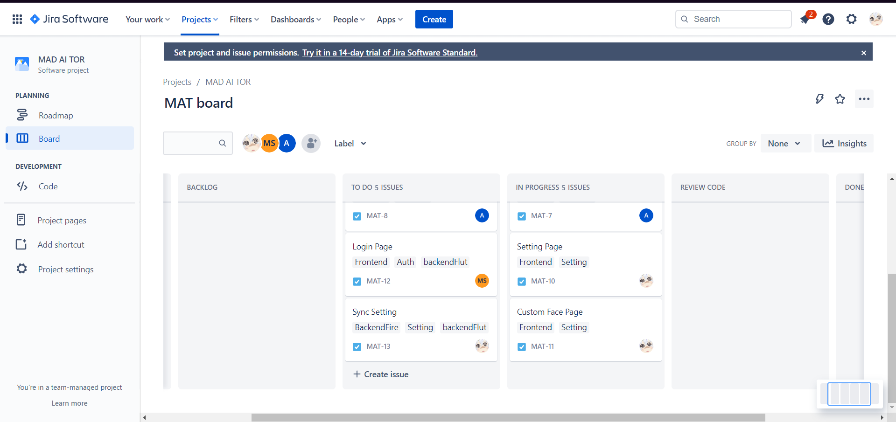

# Thursday 5-Jan-2022 14:00 - 17:30 UTC+7 (online)

## Topic

- Preparing and discussing to change the UI/UX
- More split work
- Discussing to use \*_some of_\* Agile Methodology
  - Retrospective
  - Story Pointing

## What we did in this meeting

The new discussing about the UI/UX and the new plan for the project. You can see the screen diagram in link below.

[MIRO MAD Design](https://miro.com/app/board/uXjVP1SJvkc=/?share_link_id=151264190036) (as always, this document is written in Thai and swear words :P)

And we also discuss about the Agile Methodology and use some part of Agile Methodology like story pointing, Retrospective

_we use Jira board to progress stories_

## What we will do in next meeting

- GO READ A DOC and do your work
- do Retrospective and review code every thursday. _(when code is ready to reviewing)_